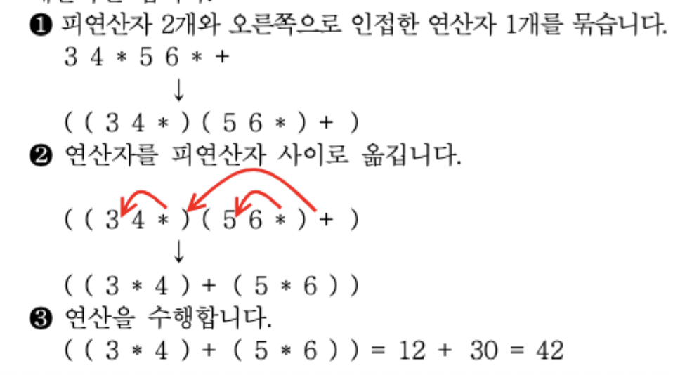
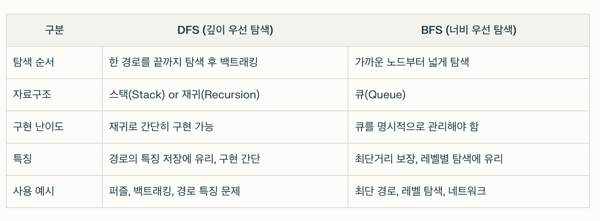

# 반정규화(Denomalization)

### 정의

- DB에서 시스템의 성능 향상이나 개발/운영의 단순화를 위해, 정규화된 엔티티, 속성, 관계에 대해 의도적으로 데이터 중복, 테이블 통합, 테이블 분리 등을 적용하는 과정
- 반정규화를 하는 이유
  - 정규화된 데이터베이스는 데이터 중복을 최소화하고 일관성을 높이지만, 테이블이 너무 잘게 쪼개져서 조회할 때 JOIN이 많아지고 속도가 느려질 수 있다. 이러한 경우, 반정규화를 통해 일부러 중복을 허용하거나 테이블 구조를 단순화하여 조회 성능을 높이고, 자주 쓰는 데이터를 더 빠르게 접근할 수 있도록 한다.

### 중복 테이블의 추가란?

- 중복 테이블 추가는 반정규화의 대표적인 방법 중 하나로, 여러 테이블에서 데이터를 자주 모아서 조회해야 하거나, 특정 범위의 데이터만 자주 처리하는 경우에 필요한 데이터만을 모아 별도의 테이블로 중복 저장하는 방법
- 사례
  - 여러 테이블을 조인해야 얻을 수 있는 결과를 자주 조회할 때
  - 통계, 집계 데이터를 빠르게 제공해야 할 때
  - 서버가 분리되어 원격 조인 비용이 클 때
  - 특정 부분만 자주 사용하는 대용량 테이블에서 일부만 떼어내서 빠르게 조회하고 싶을 때

### 반정규화 유형 중 중복 테이블을 추가하는 방법

- 집계 테이블의 추가
  - 여러 테이블의 데이터를 집계(합계, 평균 등)해서 별도의 테이블에 저장
  - ex) 매일매일의 판매 합계를 미리 저장해두는 '입별 매출 집계 테이블'
  - 원본 데이터가 바뀔 때마다 트리거나 스케줄러로 집계 테이블도 갱신
- 진행 테이블의 추가
  - 이력 관리나 특정 상태의 데이터만 모아두는 테이블
  - Ex) 주문 처리 중인 건만 따로 저장하는 '주문 진행 테이블'
- 특정 부분만을 포함하는 테이블의 추가
  - 대용량 테이블에서 자주 쓰는 일부 컬럼이나 행만 따로 떼어내서 테이블 생성
  - ex) 고객 테이블에서 자주 조회되는 이름, 전화번호만 따로 모은 '고객 요약 테이블'

# 외계인 코드

- 아주 오래되거나 참고문서 또는 개발자가 없어 유지보수 작업이 어려운 프로그램

# 디지털 저작권 관리 (DRM, Digital Rights Management)

### 정의

- 디지털 컨텐츠 (음악, 동영상, 문서, 소프트웨어 등)의 저각권을 보호하기 위해 컨텐츠의 생성, 유통, 이용 전 과정에 걸쳐 저작권자의 의도대로만 사용되도록 통제하고 관리하는 기술 체계

### 기술 요소

- 크랙 방지 기술 (Tamper Resistance)
  - DRM 시스템의 무력화나 우회 시도를 방지하는 기술
- 정책 관리 기술 (Policy Management)
  - 라이선스 발급, 사용 권한, 사용 조건 등 정책을 설정 및 관리
- 암호화 기술 (Encryption)
  - 컨텐츠와 라이선스를 암호화하여 허가된 사용자만 접근 가능하게 함
- 키 관리 기술
  - 암호화에 사용되는 키를 저장/분배하는 기술
- 식별 기술 (Identification)
  - 컨텐츠에 고유 식별 정보를 부여해 추적 및 관리
- 저작권 표현 (Right Expression)
  - 라이선스의 내용을 전자적으로 표현하는 기술

# 트리

### 차수

- 트리의 차수는 가장 차수가 많은 노드의 차수를 뜻함

### 단말 노드

- 자식이 하나도 없는 노드를 뜻함

# 물리데이터 저장소의 파티션 설계

### 정의

- `파티션 설계`란, DB에 저장된 큰 데이터를 여러 개의 작은 단위(파티션)로 나누어 저장하는 방법을 설계하는 것을 말함.
- 이렇게 하면 데이터 관리가 쉬워지고, 성능과 확장성, 가용성이 크게 향상됨

### 파티션을 사용하는 이유

- 성능 향상
  - 필요한 데이터만 빠르게 찾을 수 있어 쿼리 속도가 빨라짐
- 확장성
  - 데이터가 많아져도 파티션을 추가해 쉽게 확장할 수 있음
- 가용성
  - 일부 파티션에 문제가 생겨도 전체 시스템에 영향이 적음
- 관리 효율
  - 파티션별로 백업, 복구, 유지보수가 쉬워짐

### 파티션의 주요 설계 방법

#### 1) 파티션 키 선정

- 데이터를 어떤 기준 (ex. 날짜, 지역, ID 등)으로 나눌지 결정함

#### 2) 파티션의 수 결정

- 데이터 양, 사용 패턴, 시스템 구조에 따라 적절한 파티션 개수를 정함

#### 3) 파티션 유형 선택

- 파티션 방식 중 시스템에 맞는 방식을 고름

### 파티션 유형

#### 1) 범위 분할 (Range Partitioning)

- 특정 컬럼의 값 범위에 따라 여러 파티션으로 나눔

- 예시
  - 날짜별로 2024년, 2025년, 2026년 파틱션
  - 우편번호가 10000~19999, 20000~29999 등 범위별 분할
- 장점
  - 기간별, 숫자대별로 데이터 관리 및 삭제가 쉬움

#### 2) 해시 분할 (Hash Partitioning)

- 해시 함수를 이용해 값을 계산하고, 그 결과로 파티션을 결정함

- 예시

  - 고객 ID를 해시해서 4개의 파티션에 고르게 분산
  - 해시값이 0이면 파티션1, 1이면 파티션2

- 데이터가 자동으로 고르게 분산되어, 특정 파티션에 데이터가 몰리는 현상(핫스팟)을 방지

#### 3) 조합(복합) 분할 (Composite Partitioning)

- 여러 분할 방식을 조합해서 사용

- 예시

  - 먼저 연도별로 범위 분할, 그 안에서 해시 분할
  - 국가별 목록 분할 후, 각 국가에 맞춰 유연하게 설계

- 데이터 특성과 사용 패턴에 맞춰 유연하게 설계

#### 4) 목록 분할 (List Partitioning)

- 특정 컬럼의 정해진 값 집합에 따라 데이터를 나눔

- 예시

  - 국가별로 '한국', '미국', '아르헨티나' 각각 파티션
  - 지역별로 '서울', '부산', '제주' 등 목록별 분할

- 명확한 값 그룹(카테고리)별로 데이터 관리가 쉬움

#### 5) 라운드로빈 분할 (Round-Robin Partitioning)

- 새로 들어오는 데이터를 순서대로(돌려가며) 각 파티션에 나눠 저장함

- 예시

  - 첫번째 데이터는 파티션1, 두번째는 파티션2, 세번째는 파티션3, 네번째는 다시 파티션1,...

- 데이터가 파티션에 거의 균등하게 분배되므로 파티션의 크기가 비슷해져서 부하 분산에 유리함

- 특정 값이나 범위로 조회할 때는 효율이 떨어질 수 있음

#### 6) 수직 분할 (Vertical Partitioning)

- 테이블의 열(컬럼)단위로 분할함

- 예시

  - 자주 쓰는 컬럼만 따로 분리하여 빠르게 접근
  - 덜 쓰는 컬럼은 다른 파티션에 저장

- 특정 컬럼만 자주 조회할 때 성능이 향상됨

# 형상 관리 도구

### 주요 기능

- 체크인
- 체크아웃
- 커밋
- ~~정규화~~ > 정규화는 테이블의 속성들이 상호 종속적인 관계를 갖는 특성을 이용해서 테이블을 무손실 분해하는 과정

# 패키지 소프트웨어의 일반적인 제품 품질 요구사항 및 테스트를 위한 국제 표준

- ISO/IEC 9126
- ISO/IEC 12119
- ISO/IEC 14598
- ISO/IEC 25010

# 소프트웨어 테스트

- 테스트 케이스에는 일반적으로 시험 조건, 테스트 데이터, 예상 결과가 포함되어야 함

## 1) 블랙박스 테스트 기법

- 소프트웨어 내부 구조를 모른 채 외부 기능만 검사하는 방법
- 마치 검은 상자(Black Box)안을 들여다보지 않고, 입력(input)과 출력(output)만으로 동작을 확인하는 것과 같음

- 블랙박스 테스트는 프로그램의 구조를 고려하지 않음

### 목적

- 사용자 요구사항을 충족하는지 확인
- 기능적 오류(버그)탐색
- 사용자 관점에서의 시스템 동작 검증

### 주요 기법

#### 동치 클래스 분해 / 동등 분할

- 비슷한 입력값을 그룹으로 나누어 대표값만 테스트
- ex) 1~100점 입력시 50(정상), 101(비정상) 테스트

#### 경계값 분석

- 입력값의 경계에서 오류가 자주 발생하므로 집중 테스트
- ex) 0~100점 입력시 0, 1, 99, 100 테스트

#### 원인 결과 그래프

- 입력 조건과 결과의 관계를 그래프로 표현해 테스트 케이스 생성

#### 결정 테이블 (Decision Table)

- 다양한 조건 조합을 표로 만들어 모든 경우의 수 검증
- ex) 로그인시 ID/비밀번호 조합별 결과 테스트

- ~~기초 경로 검사~~ > 화이트박스 테스트 기법에 해당됨

### 장점

- 사용자 경험 중심 테스트
- 코드 지식 없이도 가능
- 요구사항 누락 발견 용이

### 단점

- 내부 로직 오류 탐색 어려움
- 코드 커버리지 보장 불가

## 2) 화이트박스 테스트 기법

### 정의

- 소프트웨어의 내부 코드와 구조를 알고 논리적 정확성을 검사하는 방법
- 투명한 상자(White Box)처럼 내부를 들여다보며 테스트함
- 모듈의 논리적인 구조를 체계적으로 점검할 수 있음
- ~~화이트박스 테스트에서 `기본 경로(Basis Path)`란, 흐름 그래프의 시작 노드에서 종료 노드까지의 서로 독립된 경로로 싸이클을 허용하지 않는 경로를 말한다.~~

### 목적

- 코드의 논리적 오류 수정
- 모든 실행 경로 검증
- 보안 취약점 발견

### 주요 기법

#### 1) 구문 커버리지 (Statement Coverage)

- 모든 코드 줄이 최소 1번 실행되도록 테스트

#### 2) 분기 커버리지 (Branch Coverage)

- 모든 조건문의 True/False 경우 테스트

#### 3) 경로 커버리지 (Path Coverage)

- 프로그램의 모든 가능한 실행 경로 테스트

#### 4) 루프 테스트 (Loop Testing)

- 반복문의 경계 조건과 반복 횟수 검증

### 장점

- 코드의 숨은 오류 발견
- 최적화 및 리팩토링 지원
- 보안 강화

### 단점

- 코드에 대한 깊은 이해 필요
- 시간과 비용이 많이 듦

# 인터페이스 구현 검증 도구

### 1) xUnit

- 다양한 프로그래밍 언어를 지원하는 단위 테스트 프레임워크
- 개발자가 코드의 작은 단위(함수, 클래스)를 테스트하여 "예상대로 동작하는지" 검증하는 도구

#### 목적

- 코드의 개별 기능이 정상적으로 작동하는지 확인
- 버그 조기 발견 및 리팩토링 지원

### 2) STAF (Software Testing Automation Framework)

- 분산 환경에서 테스트 자동화를 지원하는 오픈소스 프레임워크
- 다양한 OS(윈도우, 리눅스 등)와 언어(Java, Python 등)를 지원함

#### 목적

- 여러 컴퓨터와 분산된 시스템의 통합 테스트 자동화
- 테스트 환경 관리 및 재사용성 향상

#### 주요 특징

- 서비스 기반: 로깅, 프로세스 실행, 파일 관리 등 모듈화된 기능 제공
- 분산 테스트: 원격 머신에서 테스트 실행 및 결과 수집
- STAX: XML 기반 테스트 시나리오 작성 지원

#### 사용 예시

- 웹 서버, DB 서버, 클라이언트 PC가 다른 환경에서 상호작용하는 시스템 테스트
- `주문 -> 결제 -> 배송 프로세스의 전 과정 자동화 검증`

### 3) NTAF (Nhn Test Automation Framework)

- NHN에서 개발한 테스트 자동화 도구
- FitNesse(협업 기능)와 STAF (분산 환경 지원)의 장점을 결합하였음

#### 목적

- 복잡한 테스트 시나리오를 간편하게 설계 및 실행
- 팀 협업과 테스트 재사용성 강화

#### 주요 특징

- 위키 기반 테스트 설계: 비개발자도 테스트 케이스 작성 가능
- 병렬 실행: 여러 테스트를 동시에 실행해서 시간 단축

### cf) ~~ESB~~

- Enterprise Service Bus

- 기업 내 애플리케이션을 연결하는 통합 플랫폼
- 서비스 간 메시지 전달, 프로토콜 변환, 보안 관리 등을 중앙에서 처리함

- 애플리케이션간 연계, 데이터 변환, 웹 서비스 지원 등 표준 기반의 인터페이스를 제공하는 솔루션

# postfix 연산식

- 연산자가 해당 피연산자 두 개 뒤(오른쪽)에 놓인 것을 뜻함
- 피연산자 2개와 연산자를 묶은 후 연산자를 피연산자 사이에 옮겨 놓고 계산 하면 됨

### postfix 예시

- `3 4 * 5 6 * +`

# Infix (중위) 연산식

- 연산자가 피연산자(숫자) 사이에 위치
- ex. `(3+4)*5`

# Prefix(전위) 연산식

- 연산자가 피연산자 앞에 위치
- 연산자를 먼저 표시하고 연산에 필요한 피연산자를 나중에 표기함
- ex. `* + 3 4 5  -> (3+4) * 5`

# 테스트 케이스

### 테스트 케이스에 일반적으로 포함되는 항목

- 테스트 조건
- 테스트 데이터
- 예상 결과
- ~~테스트 비용~~ > 테스트 비용은 포함되지 않음ㄴ

# 이진 검색 알고리즘 (Binary Search)

- 정렬된 배열이나 리스트에서 원하는 값을 빠르게 찾는 탐색 알고리즘
- 탐색 범위를 반복해서 절반씩 줄여가며 값을 찾기 때문에 검색 속도가 매우 빠른 것이 특징임

### 동작 원리

- 정렬된 배열에서만 사용할 수 있음
- 배열의 중간값을 선택해, 찾으려는 값과 비교함
- 찾는 값이 중간값보다 크면 오른쪽 구간만, 적으면 왼쪽 구간만 다시 탐색함
- 이 과정을 값을 찾거나(성공), 더 이상 범위가 없을 때까지(실패) 반복함

### 특징

- 탐색 효율이 좋고 탐색 시간이 적게 소요됨
- 검색할 데이터가 정렬되어 있어야 함
- 비교횟수를 거듭할 때마다 검색 대상이 되는 데이터의 수가 절반으로 줄어듦

### 예시

- 정렬된 배열 [2,4,6,8,10,12,14,16,18] 에서 8을 찾는 과정

1. 중간값 10과 8을 비교 -> 8이 더 작으므로 왼쪽 [2,4,6,8]만 탐색
2. 다시 중간값 4와 8을 비교 -> 8이 더 크므로 오른쪽 [6,8]만 탐색
3. 중간값 6과 8을 비교 -> 8이 더 크므로 오른쪽 8만 탐색
4. 8을 찾음 -> 탐색 종료

# 라디오 버튼

- 여러 개의 선택 항목 중 하나만 선택 가능한 경우 사용하는 사용자 인터페이스 요소

# 체크박스

- 여러 개의 선택 상황에서 1개 이상의 값을 선택할 수 있는 버튼

# 텍스트 박스

- 사용자가 데이터를 입력하고 수정할 수 있는 상자

# 스택

### 스택을 이용한 연산

- 재귀 호출
- 후위 표현 (Post-Fix Expression)의 연산
- 깊이 우선 탐색
- 스택은 재귀 호출, 후위 표기법, 깊이 우선 탐색과 같이 왔던 길을 되돌아가는 경우에 사용함

# 성능 테스트 도구

- 애플리케이션의 처리량, 응답 시간, 경과 시간, 자원 사용률에 대해 가상의 사용자를 생성하고 테스트를 수행함으로써 성능 목표를 달성하였는지를 확인하는 테스트 자동화 도구

# 소스 정적 분석

- pmd, cppcheck등은 소프트웨어 적인 방석으로 코드 분석이 가능하다.
  - PMD (Programming Mistack Detector)
    - 주로 Java와 Apex(Salesforce) 소스콛의 품질을 자동으로 검사하는 데 사용됨
  - Cppcheck
    - C와 C++언어를 위한 오픈소스 정적 코드 분석 도구
    - 소스코드를 실행하지 않고(정적 분석), 컴파일 전에 코드의 잠재적 문제를 찾아냄
- 소스 코드를 실행시키지 않고 분석한다.
- 코드에 있는 오류나 잠재적인 오류를 찾아내기 위한 활동이다.
- 자료 흐름이나 논리 흐름을 분석하여 비정상적인 패턴을 찾을 수 있다.

# 형상 관리

- 형상 관리를 통해 가시성과 추적성을 보장함으로써 소프트웨어의 생산성과 품질을 높일 수 있다

### 형상 식별

- 형상 관리 계획을 근거로 형상 관리의 대상이 무엇인지 식별하는 과정

### 형상 감사

- 형상 감사는 형상 관리 계획대로 형상 관리라 진행되고 있는지, 형상 항목의 변경이 요구사항에 맞도록 제대로 이루어졌는지 등을 살펴보는 항목임

### 형상 통제

- 형상 통제 과정은 식별된 형상 항목에 대한 변경 요구를 검토하여 현재의 기준선(Base Line)이 잘 반영될 수 있도록 조정하는 작업임

# 깊이 우선 탐색 (DFS, Depth-First Search)

- **한 경로를 끝까지 탐색한 뒤, 더 이상 갈 곳이 없으면 이전 갈림길로 돌아와 다른 경로를 탐색하는 방식**

- 정점에서 자식 노드 방향으로 운행하면서 형제 노드와 자식 노드가 있을 때 자식 노드를 우선 탐색하는 기법임
- 자식 노드의 탐색이 모두 끝나면 다시 형제 노드부터 탐색을 시작하는 방식으로, 모든 노드를 한 번씩 방문함

### 동작 방식

- 시작 노드에서 출발하여, 갈 수 있는 곳까지 최대한 깊이 들어감
- 더 이상 갈 곳이 없으면 **되돌아와(백트래킹)**, 다른 경로를 탐색함

### 구현 방식

- 스택(Stack)자료구조를 사용하거나, 재귀 함수로 간단히 구현할 수 있음

### 특징

- 경로의 특징을 저장해야 하는 문제에 적합 (ex. 퍼즐, 백트래킹)
- 구현이 간단함
- 미로 찾기, 퍼즐 등 경로의 특징이 중요한 문제에 적용

### 시간 복잡도

- O(V+E)
- V: 노드 수, E: 간선 수

# 너비 우선 탐색 (BFS, Breadth-First Search)

- 시작 노드에서 가까운 노드부터 차례대로 넓게(한 단계씩) 방문하는 방식

### 동작 방식

- 시작점에서 가까운 노드들부터 모두 방문한 후, 그 다음 단계의 노드들을 방문함

### 구현 방식

- **큐(Queue)** 자료구조를 사용해서 구현함

### 특징

- 최단 경로를 보장해야 하는 문제에 적합
- 레벨별(거리별) 탐색에 유리

### 시간 복잡도

- O(V+E)
- V: 노드 수, E: 간선 수

# 퀵 정렬 (Quick Sort)

### 원리

- 분할 정복(Divide and Conquer)에 기반한 알고리즘으로 피봇(pivot)을 사용하는 정렬
- **기준값(pivot)**을 하나 정해서 이보다 작은 값은 왼쪽, 큰 값은 오른쪽으로 분할(Partition)함
- 이 과정을 양쪽 그룹에 재귀적으로 반복함

### 동작 과정

1. 피벗을 하나 고름 (ex. 맨 앞, 맨 뒤, 랜덤 등)
2. 피벗보다 작은 값은 왼쪽, 큰 값은 오른쪽 그룹으로 나눔
3. 각 그룹에 대해서 다시 퀵 정렬을 반복
4. 모든 그룹이 1개 이하가 될 때까지 반복

### 특징

- O(N^2)

# 선택 정렬 (Selection Sort)

### 원리

- 배열에서 가장 작은(또는 큰)값을 찾아 맨 앞(또는 맨 뒤)과 교환하는 과정을 반복
- 한 번에 한 자리씩 '이 자리에 들어갈 값을 선택'하는 방식

### 동작 과정

1. 첫 번째 위치에 올 값을 찾기 위해 전체 배열을 훑어 가장 작은 값을 찾음
2. 그 값을 첫 번째 값과 교환함
3. 두 번째 위치에 올 값을 찾기 위해 남은 배열을 훑어 가장 작은 값을 찾아서 두 번째 값과 교환함
4. 이런 식으로 배열 끝까지 반복하면 정렬이 완료됨

### 특징

- O(N^2)

# 버블 정렬(Bubble Sort)

### 원리

- 인접한 두 값을 비교해서 순서가 잘못된 경우 서로 교환함
- 이 과정을 반복하면 가장 큰(또는 작은)값이 맨 끝으로 '버블처럼' 올라감
- 큰 값이 마치 거품(bubble)처럼 배열 끝으로 점점 올라가는 모습에서 이름이 유래됨

### 동작 과정

1. 배열의 처음부터 끝까지 인접한 두 수를 비교
2. 순서가 잘못된 경우 교환
3. 한 번의 반복이 끝나면 가장 큰값이 맨 뒤로 감
4. 전체 배열이 정렬될 때까지 반복

### 특징

- O(N^2)

# 삽입 정렬 (Insert Sort)

### 원리

- 앞에서부터 차례로 이미 정렬된 부분과 비교하여 자신의 위치를 찾아 삽입하는 방식입니다.
- 마치 카드를 한 장씩 정렬해서 손에 쥐는 것과 비슷합니다.

### 동작 과정

1. 두 번째 값부터 시작해서 그 앞의 값들과 비교함
2. 자신의 값보다 큰 값이 나오면 그 값을 오른쪽으로 밀고, 빈자리에 자신의 값을 삽입함
3. 이 과정을 배열 끝까지 반복하면 정렬이 완료됨

# 테스트 하네스

- 소프트웨어 테스트를 자동화하고 지원하기 위해 만들어진 코드와 데이터의 집합
- 주로 프로그램의 유닛이나 모듈을 다양한 조건에서 테스트하고, 그 결과를 모니터링하기 위한 환경을 제공함

### 구성요소

- 테스트 드라이버
  - 테스트 대상 하위 모듈을 호출하거나 제어하는 도구
  - 상위 모듈이 없는 경우 사용
- 테스트 스텁
  - 구현이 완료되지 않은 하위 모듈을 대신하는 더미 컴포넌트. 하위 모듈이 없는 경우 사용
- 테스트 슈트
- 테스트 케이스/테스트 스크립트
  - 자동화된 테스트 절차와 입력 데이터, 기대 결과를 명시
- 목 오브젝트
- 테스트 러너
  - 테스트 스크립트를 실행하고 결과를 보고하는 도구
