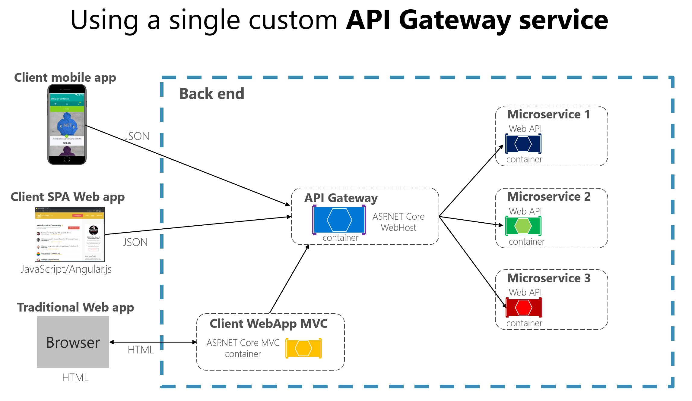
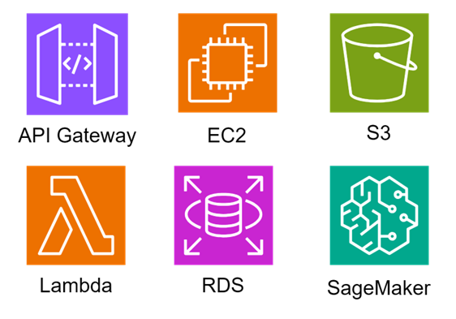

# API Gateway

## API 게이트웨에란?

- ㅁ

## API 게이트웨이가 없던 시절 직면한 문제

- 과거의 서비스들은 하나의 큰 덩어리(모놀리식 아키텍처)였지만, 서비스가 점점 커지고 복잡하졌음

- API 게이트웨이가 없던시절 ~~~~~~~~~~한 문제에 직면 하였음

- 그래서 마이크로서비스 아키텍처가 등장하였음
  - 이에 따라 하나의 큰 서비스를 잘게 쪼개어, 각각 독립적으로 개발하고 배포할 수 있게 되었음.
    (장점: 빠른 개발, 유연한 확장 등)

### MSA가 긍정적이기만 했을까?

- 하지만 클라이언트(웹/앱)입장에서는 다음과 같은 문제가 있었음
  - 수많은 마이크로서비스들의 주소(엔드포인트)들을 다 알아야 함
  - 각 서비스마다 인증 방식이 다를 수 있음
  - 공통적으로 처리해야 할 일들(로깅, 모니터링 등)을 모든 서비스에 중복으로 구현해야 함
- 예를들면, 여러 식당(마이크로서비스)의 음식을 한 번에 주문하고 싶은데, 각 식당에 일일이 전화해서 주문하고, 각 식당마다 다른 결제 수단을 사용해야하는 번거로운 상황인 것이다.

## 구세주 API 게이트웨이

API 게이트웨이는 모든 요청을 위한 단일 창구이다

- API 게이트웨이는 `시스템의 모든 API 요청이 거쳐가는 단일 진입점(Entry Point)`이다

- 마치 건물의 `안내 데스크`나 `경비실`과 같은 것이다

  - 외부 방문객(클라이언트 요청)은 안내 데스크를 통해야만 내부의 특정 부서(마이크로서비스)로 연결될 수 있는 것이다

- 클라이언트는 API 게이트웨이와만 통신하고, 게이트웨이가 알아서 요청을 적절한 마이크로서비스로 전달(라우팅)해준다

## API 게이트웨이의 주요 역할

API 게이트웨이는 똑똑한 문지이의 역할을 한다
 구체적으로는 다음과 같은 역할을 수행한다.

### 1) 라우팅 (Routing)

- 요청을 분석해서 어떠한 서비스로 보내야할지 결정하고 전달한다
- ex) `/users`요청은 사용자 서비스로, `/products`요청은 상품 서비스로 보낸다

### 2) 인증 및 인가 (Authentication & Authorization)

- 모든 요청에 대해 보안검사를 중앙에서 처리해주기 때문에 각 서비스의 부담을 덜어준다
- 인증: '누가 접속하였는지'
- 인가: '이 기능을 사용할 권한이 있는가'

### 3) 요청/응답 변환 (Request/Response Transformation)

- 클라이언트가 이해하기 쉬운 형태로 데이터를 가공하거나, 서비스간 데이터 형식을 맞춰줌

### 4) 로깅 및 모니터링 (Logging & Monitoring)

- 모든 요청과 응답을 기록하고, 시스템 상태를 감시하여 문제가 생겼을 때 빠르게 파악할 수 있게 도와줌

### 5) 로드 밸런싱 (Load Balancing)

- 특정 서비스에 요청이 몰리지 않도록 여러 서버에 골고루 분산시킨다
- 이를 통해 서비스 안정성 향상에 기여한다

### 6) 캐싱 (Caching)

- 자주 요청되는 데이터를 미리 저장해두고 빠르게 응답하여 시스템 성능을 향상시킨다

## API 게이트웨이와 마이크로서비스 아키텍처

서비스를 잘게 나누는 방식인 MSA를 사용하는 시대에서 API 게이트웨이는 선택이 아닌 필수사항일 것 같다.

### 만약 게이트웨이가 없다면

- 클라이언트는 수십, 수백 개의 서비스 주소를 모두 관리해야 한다.  => 복잡도

- 서비스가 추가되거나 변경될때마다 클라이언트 코드도 수정해야 할 수 있다 => 유연성 저하

- 보안, 로깅 등을 모든 서비스에 개별적으로 구현해야 한다.  
  => 개발 비용 증가, 일관성 유지가 어려워짐

### 이에 반해 API 게이트웨이가 있다면

- 클라이언트는 오직 API 게이트웨이를 바라본다. 
  => 단순성, 느슨한 결합 (Loose Coupling)

- 백엔드 서비스 변경에 클라이언트가 받는 영향이 최소화된다.

- 공통 기능을 중앙에서 처리하므로 개발 효율성과 운영 안정성이 높아진다.

- 그러므로 API 게이트웨이는 **MSA 환경에서 서비스들을 외부로부터 보호하고, 클라이언트와의 상호작용을 단순화하여, 전체 시스템의 관리를 용이하게 하는 핵심 구성 요소**이다.

  - cf) loose coupling
    
    - 'Loose coupling'는 소프트웨어 개발과 아키텍처에서 사용되는 개념으로, 시스템의 각 구성 요소가 서로 최소한의 상호작용으로 있는 상태를 뜻한다.
    - 이는 소프트웨어 서비스 간의 의존성을 최소화하여 서로 큰 영향을 미치지 않게 함으로써 유연성을 높이는 데 중점을 둔 설계 원칙이다.
    - ex) AWS
      
      - AWS 클라우드는 Loose Coupling의 원리로 설계되어있음
      - AWS 클라우드는 하나의 큰 서비스이지만 세부적으로 200개가 넘는 서비스가 존재함
      - 예를들어, S3,EC2, Lambda, RDS 등의 서븨스는 각각 독립적으로 운영되며 서로에게 직접적인 의존성을 갖지 않는다. (연관성은 있으나, 기본적으로 독립적으로 작동함)

## 키워드

- API Gateway
- Service Mesh
- PoC (Proof of Concept)
- emissary ingress
- Linkerd
- 미들웨어 (api 게이트웨이는 미들웨어의 역할)

## 참고자료

- [오늘의집](https://www.bucketplace.com/post/2021-11-19-%EC%98%A4%EB%8A%98%EC%9D%98%EC%A7%91-msa-%EC%97%AC%EC%A0%95-part-1-%EC%8B%9C%EC%9E%91/)

- [Web applicartion architecture](https://dev.to/techelopment/web-application-architecture-front-end-middleware-and-back-end-2ld7)
